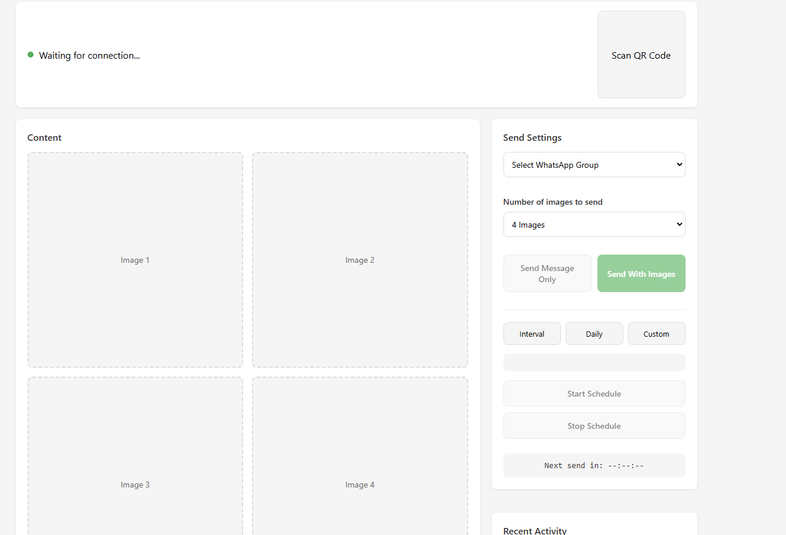
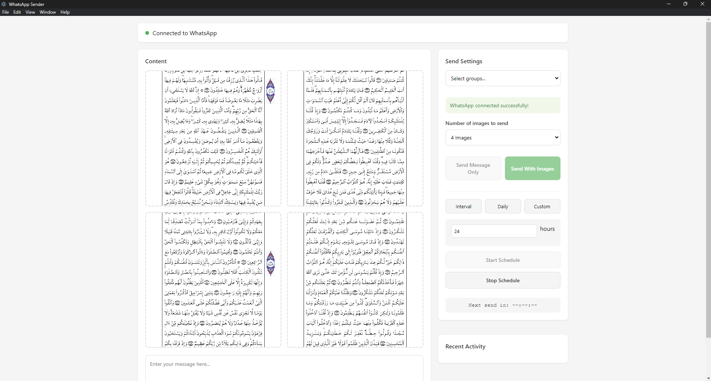
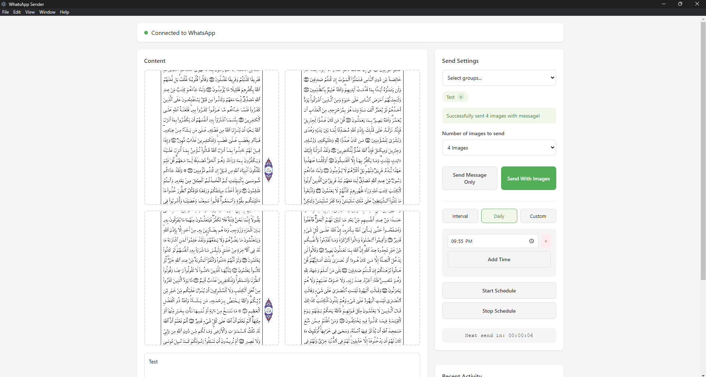

# WhatsApp Group Sender

<div align="center">

[](https://github.com/Realwahba)
[](LICENSE)
[](https://github.com/Realwahba/WhatsApp-Group-Sender/stargazers)

A powerful desktop application that revolutionizes how you manage WhatsApp group communications. Built with ❤️ using Electron.

[Report Bug](https://github.com/Realwahba/WhatsApp-Group-Sender/issues) · [Request Feature](https://github.com/Realwahba/WhatsApp-Group-Sender/issues)

</div>

## About The Project

WhatsApp Group Sender is a professional-grade desktop application designed and developed by [Wahba](https://github.com/Realwahba) to streamline mass communication through WhatsApp groups. Whether you're managing marketing campaigns, sending updates to multiple groups, or coordinating large-scale communications, this tool makes it effortless and efficient.

### Why Choose This Tool?

- 🚀 **Efficient Multi-Group Messaging**: Send messages to multiple groups with just one click
- 📸 **Smart Image Handling**: Queue and send up to 4 images simultaneously
- ⏰ **Flexible Scheduling**: Set custom schedules for automated message sending
- 📊 **Activity Tracking**: Monitor all your sending activities with detailed logs
- 🔄 **Reliable Connection**: Robust WhatsApp Web integration with auto-reconnection
- 💫 **User-Friendly Interface**: Clean, intuitive design for seamless operation

## Application Interface

### Main Interface

*The main application interface showing message composition, image slots, and group selection*

### Connected State

*Application successfully connected to WhatsApp with groups loaded*

### Image Sending Interface

*Image sending interface with preview slots and sending controls*

## Features

- 🔄 Connect to WhatsApp via QR code scanning
- 👥 Select and manage multiple WhatsApp groups
- 📝 Send text messages to selected groups
- 🖼️ Queue and send up to 4 images at once
- ⏰ Flexible message scheduling:
  - Interval-based scheduling
  - Daily scheduling at specific times
  - Custom scheduling for different days of the week
- 📊 Activity tracking and logging
- 🔄 Auto-reconnection handling
- 📱 Responsive design

## Prerequisites

Before you begin, ensure you have met the following requirements:

- Node.js (v14 or higher)
- Google Chrome installed (the application uses Chrome for WhatsApp Web integration)
- A WhatsApp account with active groups
- The WhatsApp account must be:
  - An active phone number with WhatsApp installed
  - Not a Business API account
  - Not restricted or banned
- A stable internet connection
- Your phone must be:
  - Connected to the internet
  - Have enough battery (recommended >60% or plugged in)
  - Not in power saving mode (can affect background processes)

## Installation

1. Clone the repository:
```bash
git clone https://github.com/yourusername/whatsapp-group-sender.git
cd whatsapp-group-sender
```

2. Install dependencies:
```bash
npm install
```

3. Create required directories:
```bash
mkdir images
mkdir logs
mkdir .wwebjs_auth
```

4. Start the application:
```bash
npm start
```

## Initial Setup

1. **Prepare Your Environment**
   - Ensure Google Chrome is installed in the default location:
     - Windows: `C:\Program Files\Google\Chrome\Application\chrome.exe`
     - Mac: `/Applications/Google Chrome.app/Contents/MacOS/Google Chrome`
     - Linux: `/usr/bin/google-chrome`
   - Create an 'images' folder in the application directory
   - Ensure your phone has WhatsApp installed and is working properly

2. **WhatsApp Connection**
   - Launch the application
   - Open WhatsApp on your phone
   - Go to WhatsApp Settings > Linked Devices
   - Click "Link a Device"
   - When the QR scanner opens, scan the QR code shown in the application
   - Wait for the connection to be established (this might take a few moments)
   - Keep your phone connected to the internet

3. **Image Preparation**
   - Place your images in the 'images' folder
   - Images must be in JPG format
   - Name your images numerically (e.g., 1.jpg, 2.jpg) for proper sequencing
   - Maximum image size: 16MB per image
   - Recommended resolution: 1280x720 or lower for optimal sending

## Usage

1. **Group Management**
   - After connection, your WhatsApp groups will automatically appear in the dropdown
   - Select groups you want to send messages to
   - You can select multiple groups at once

2. **Message Settings**
   - Type your message in the text area
   - The application supports both LTR and RTL text
   - You can include emojis
   - Maximum message length: 4096 characters
   - Supports formatting: *bold*, _italic_, ~strikethrough~, ```code```

2. **Sending Messages**
   - Select one or more WhatsApp groups from the dropdown
   - Type your message in the text area
   - If needed, queue up to 4 images
   - Click "Send Message Only" or "Send With Images"

3. **Scheduling Messages**
   - Choose a schedule type (Interval, Daily, or Custom)
   - Configure the schedule settings
   - Click "Start Schedule" to begin automated sending
   - Use "Stop Schedule" to cancel scheduled messages

4. **Managing Images**
   - Place your images in the `images` folder
   - Images should be in JPG format
   - Images will be sent in sequence based on their names
   - The application tracks the last sent image and continues from there

## Configuration

The application creates several configuration files:

- `activity_log.json`: Tracks sending activities and remaining images
- `image_index.json`: Keeps track of the last sent image
- `schedule_config.json`: Stores scheduling preferences

## Development

To modify the application:

1. Main files:
   - `main.js`: Contains the Electron backend logic
   - `index.html`: Contains the frontend UI and scripts

2. Run in development mode:
```bash
npm run dev
```

## Building

To create an executable:

```bash
npm run build
```

This will create distributable files in the `dist` directory.

## Security Notes

- The application uses local authentication to store WhatsApp session data
- All data is stored locally on your machine
- No messages or media are stored on external servers
- Always ensure you're using the application in compliance with WhatsApp's terms of service

## Troubleshooting

1. **Connection Issues**
   - If QR code scanning fails:
     - Clear the `.wwebjs_auth` directory
     - Restart the application
     - Try scanning again
   - If connection drops:
     - Check your internet connection
     - Ensure your phone is online
     - Restart the application
     - Re-scan the QR code if needed

2. **WhatsApp Limitations**
   - Maximum of 256 groups can be managed
   - Message rate limits apply (varies by account age and status)
   - Image sending may be slower than text messages
   - Some features may not work with Business API accounts

3. **Common Problems**
   - "Chrome not found": Check Chrome installation path
   - "Authentication Failed": Clear `.wwebjs_auth` and try again
   - "Unable to send message": Check group admin settings
   - "Image failed to send": Verify image format and size
   - "Schedule not working": Check system time and internet connection

4. **Best Practices**
   - Don't send too many messages too quickly
   - Keep images under 16MB
   - Don't use the same session on multiple devices
   - Regularly check the activity log for errors
   - Keep your phone powered and connected

2. **Image Sending Problems**
   - Verify images are in JPG format
   - Check image file permissions
   - Ensure images are properly named and sequenced

3. **Scheduling Issues**
   - Verify system time is correct
   - Check if the application has necessary permissions
   - Review schedule configuration in the logs

## Contributing

1. Fork the repository
2. Create your feature branch (`git checkout -b feature/AmazingFeature`)
3. Commit your changes (`git commit -m 'Add some AmazingFeature'`)
4. Push to the branch (`git push origin feature/AmazingFeature`)
5. Open a Pull Request

## Contact & Support

- **Developer**: Wahba
- **Email**: heywahba@gmail.com
- **LinkedIn**: https://www.linkedin.com/in/heywahba/
- **GitHub**: [@Realwahba](https://github.com/Realwahba)

### Support My Work

If you find this tool helpful, consider:
- ⭐ Starring this repository
- 🐛 Reporting issues
- 🚀 Contributing to the project
- 📣 Sharing with others who might benefit

## License

Distributed under the MIT License. See `LICENSE` for more information.

## Acknowledgments

Special thanks to:
- [whatsapp-web.js](https://github.com/pedroslopez/whatsapp-web.js) for WhatsApp Web integration
- [Electron](https://www.electronjs.org/) for the desktop application framework
- All the users who have provided valuable feedback

---

<div align="center">
Made with ❤️ by <a href="https://github.com/Realwahba">Wahba</a>

If this project helps you, you can show your appreciation by starring the repository 🌟
</div>

## Disclaimer

This project is not affiliated with WhatsApp or Meta. Use the application responsibly and in accordance with WhatsApp's terms of service and applicable laws regarding automated messaging.
